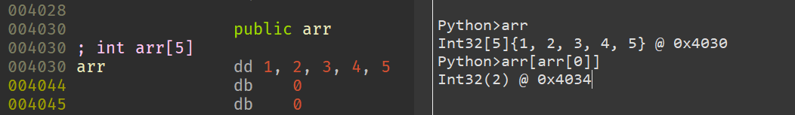
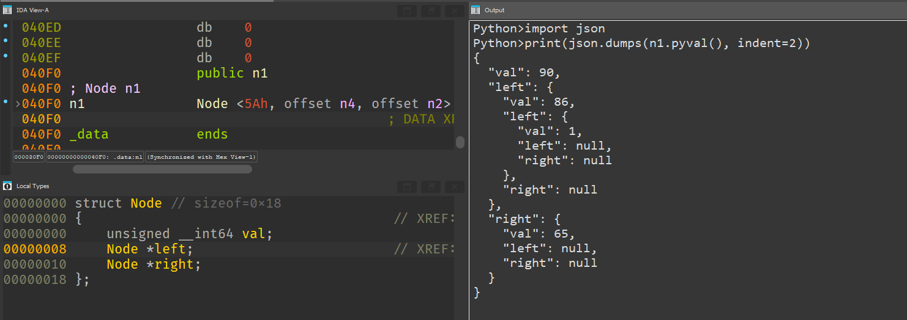
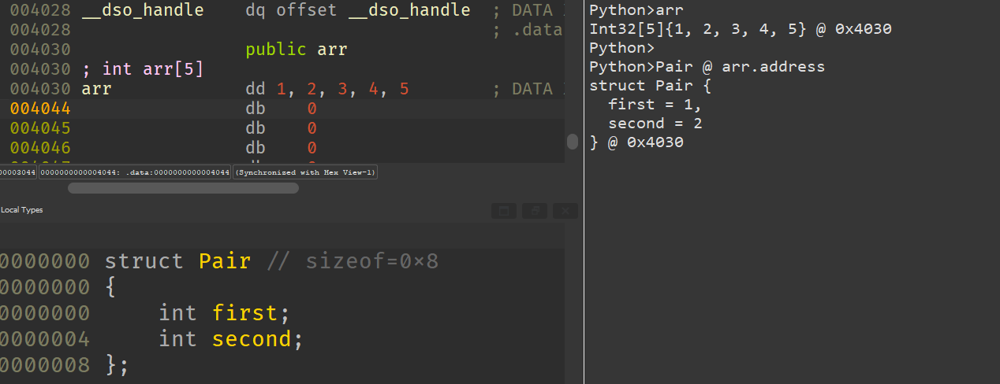

# ida2py

An intuitive query API for IDA Pro

## Features

All global variables with defined names and types are now accessible directly in IDAPython.

   
    

ida2py supports [most](#the-ida2py-type-system) IDA data types, including arrays, structs, pointers or a combination of the above. To convert a variable to a (primitive) Python object, simply call `.pyval()`.  

User defined types are available in Python as well.    

You can either use `Type @ address` or `Type(address)`.

`Type()` is a shorthand for `Type @ idc.here()`. You can use the `*` operator to create array types.

If your variable/type name is not a valid Python identifier, you can use the `_ida(name)` function to obtain a reference to it instead. For example, `_ida("Node") == Node`.

For more detailed/advanced usage, refer to the [tests](./tests/).

## Installation

Simply copy `ida2py.py` to your IDA plugin directory.

## How it works

## The ida2py type system

ida2py supports 6 basic types:
1. Integers
2. Strings (this might be removed in the future)
3. Arrays
4. Structs
5. Pointers
6. Functions (more features coming here)

If ida2py cannot determine the type of a variable, or if it does not fit within the type system, the `Unknown` type will be returned.

Non-integral numeric types, such as floats and doubles, are not currently supported. 

It is likely that some types will not be accurately represented, and the type system is quite complicated, so bug reports are always welcome.

### Global scope modification
The `ctypes` module is used to modify the `PyObject` of the current scope's `globals()` dictionary. By installing a fake `globals` class with a custom `__getitem__` method, we can intercept variable accesses before they cause a `NameError` and instead return an appropriate object derived from IDA. 

This is similar to, and builds upon, my previous ['C Types for Python'](https://gist.github.com/junron/9e203a745095e793f92922c4e208e9ff) project.

Note that this is not official or intended Python behavior, so usage of this library may crash IDAPython or your entire IDA Pro application.